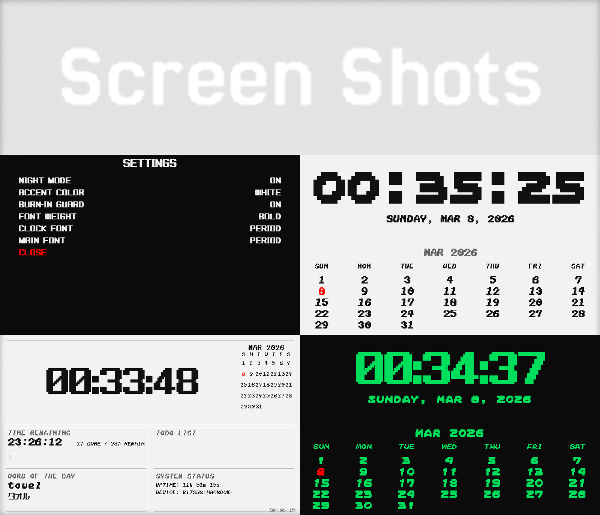

# DP-05


DP-05 は、Sharp Brain PW-SH2（Windows Embedded CE 6.0）向けに開発したダッシュボードアプリです。
Teenage Engineering や Nothing OS の工業的な UI を参考にし、時計、カレンダー、Todo、辞書、システム情報を一つの画面にまとめています。

## ⚙️ 主な機能

- **インダストリアルな UI**：Teenage Engineering や Nothing OS を参考にした、直線的で情報密度の高いデザインです。
- **マルチページナビゲーション**：左右キーでページを切り替え、Cubic Out easing の横スライドで遷移します。
- **4 つの表示モード**：
  - **Dashboard**：時計、カレンダー、残り時間、Todo、辞書、システム状況をまとめて表示します。
  - **Huge Clock & Calendar**：上半分に時計、下半分にカレンダーを大きく表示します。
  - **Todo List（TofuMental Sync）**：[TofuMental](https://github.com/nisesimadao/TofuMental) の `tasks.txt` と同期します。文字コードは UTF-16LE です。
  - **Dictionary Detail**：「Word of the Day」の詳細情報を表示します。
- **カスタマイズ**：
  - **Settings Menu**：Enter キーで設定画面を開きます。
  - **Night Mode**：明暗に応じて配色を切り替えます。アクセントカラーは Green / Amber / Blue / Red / White から選択できます。
  - **Font Matrix**：`TenoText` シリーズや `CP period` などのビットマップフォントを選択できます（[TenoText](https://tenokun.neocities.org/) / [CP period](https://yokutobanaitori.web.fc2.com/quizfont.html#quizfont6)）。
- **設定保存と表示保護**：
  - **Auto Saving**：設定変更を `DP05_Settings.cfg` へ保存します。
  - **Burn-in Guard**：液晶の焼き付きを抑えるため、表示位置を小さく移動させる Sub-Pixel Drift Matrix を備えています。



## ⌨️ 操作方法

| キー | アクション |
| :--- | :--- |
| **左右キー** | ページ（Dashboard / Clock / Todo / Dictionary）を切り替える |
| **Enter（Dashboard）** | Settings を開く |
| **Enter（Settings）** | 設定を確定して Settings を閉じる |
| **上下キー（Settings）** | 項目選択 / 値の変更 |
| **上下キー（Todo / Dict）** | 項目選択 / スクロール |
| **Space（Todo）** | タスクの完了状態を切り替え、`tasks.txt` へ保存する |
| **Escape** | Settings を閉じる、またはアプリを終了する |

## 📁 プロジェクト構成

```text
.
├── src/                # C++ ソースコード (main.cpp, Dictionary.h)
├── assets/             # アセット
│   ├── fonts/          # TTF フォント
│   ├── sounds/         # 効果音 (WAV)
│   └── images/         # アイコン、スプラッシュ画像
├── build_scripts/      # ビルドスクリプト (WinCE / Windows 10)
├── scripts/            # Python ユーティリティ (BMP/Sound 生成)
├── Example/            # ビルド済みバイナリと実行用アセットの同期先
├── dist_win10/         # Windows 10 用ビルド出力
└── Original/           # 元になった Next.js プロジェクト
```

## 🛠 ビルド方法

### Unix 系環境

#### Windows Embedded CE 6.0（Sharp Brain）

CeGCC が必要です。

```bash
cd build_scripts
./build.sh
```

ビルドに成功すると、実行ファイルとアセットを `Example` フォルダへ同期します。
スクリプトには SD カードへのデプロイ処理も含まれます。

#### Windows 10（Desktop Preview）

MinGW-w64（`x86_64-w64-mingw32-g++`）が必要です。

```bash
cd build_scripts
./build_win10.sh
```

`dist_win10` に `AppMain_win10.exe` を生成します。

### Windows

#### Windows Embedded CE 6.0（Sharp Brain）

CeGCC と WSL が必要です。

```powershell
cd build_scripts
./build_ce.ps1
```

ビルドに成功すると、実行ファイルとアセットを `Example` フォルダへ同期します。
スクリプトには SD カードへのデプロイ処理も含まれます。

#### Windows 10（Desktop Preview）

Visual Studio 2022（MSVC）が必要です。

```powershell
cd build_scripts
./build_win10.ps1
```

`dist_win10` に `AppMain_win10.exe` を生成します。

## 🎨 デザイン方針

UI は、柔らかい影を多用せず、境界と情報配置を明確にする方向で設計しています。

- **光源**：左上 35° を基準にします。
- **レイアウト**：画面を上下 50:50 に分割し、上部は余白を多く、下部は情報密度を高くします。
- **アニメーション**：ボタンの押下量は 0.5 px 程度、アニメーション時間は 0.1〜0.2 秒程度に抑えます。

---

[MIT License](LICENSE)
